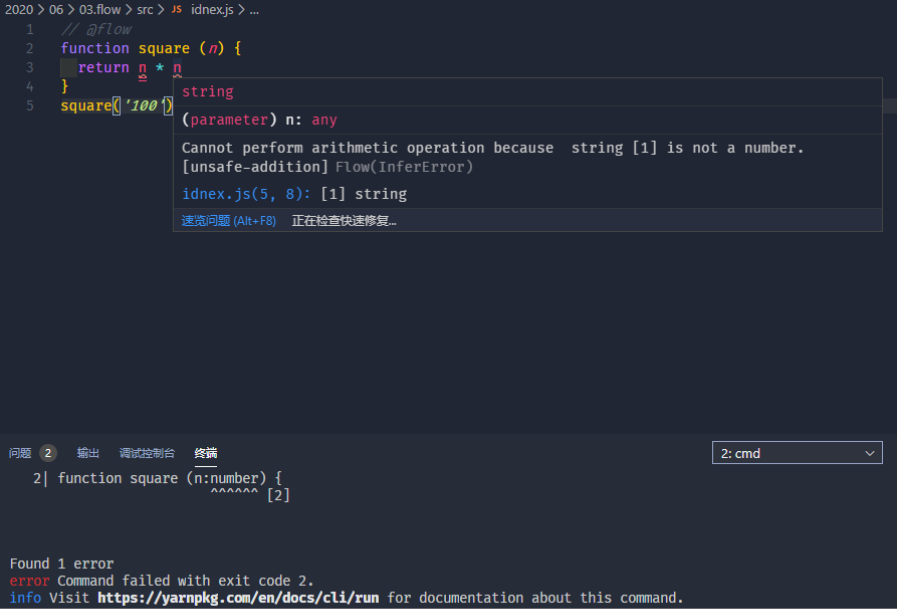
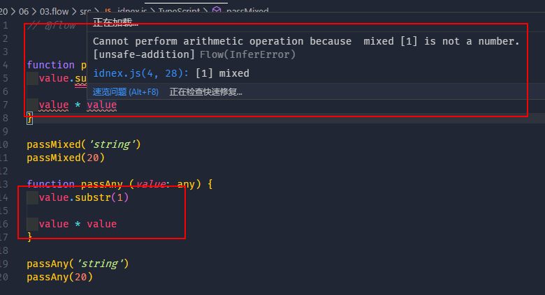

## Flow 概述

> 是一个 `JavaScript` 的静态类型类型检查器，是2014年由 `Facebook` 推出的一款工具，使用它可以弥补 `JavaScript` 弱类型所带来的一些弊端，也可以说它是为 `JavaScript` 提供了更完善的类型系统
>
> 工作原理：让我们在代码中通过添加一些类型注解的方式来去标记代码当中每个变量或者是参数它应该是什么类型的，`Flow` 根据这些类型注解就可以检查代码当中是否会存在一些类型使用上的异常，从而去实现开发阶段对类型异常的检查，这就避免了运行阶段再去发现这种类型使用上的错误

#### 快速上手

通过 `yarn init --yes` 初始一个 `package.json` 用来管理项目当中的依赖，然后通过 `yarn add flow-bin` a安装 `Flow` 工具，安装之后在需要使用 `Flow` 校验的 `Js` 文件的开头添加 `// @flow` 去校验，在命令行中初始化 `Flow` 的配置文件 `yarn flow init` ，然后通过在命令行中执行 `yarn flow` 进行语法校验

#### 编译移除注解

* 通过官方提供的 `flow-remove-types` 模块

  * `yarn add flow-remove-types` 安装模块
  * `yarn flow-remove-types . -d dist` 来编译 `Js`

* 使用 `bable` 移除类型注解

  * 安装模块：`yarn add @babel/core @babel/cli @babel/preset-flow --dev`

    * `@babel/core` 是 `babel` 的核心模块
    * `@babel/cli` 是 `babel` 的 `cli` 工具，可以让我们在命令行当中直接去使用 `babel` 命令去完成编译
    * `@babel/preset-flow` 就是包含了转换 `Flow` 类型注解的一个插件

  * 在目录下创建一个 `.babelrc` 的文件，在文件中添加：

    ```javascript
    {
        "presets": ["@babel/preset-flow"]
    }
    ```

  * 在命令行中执行 `yarn babel src -d dist `

    * `src` 表示需要编译的 `Js` 文件所在的目录
    * `dist` 表示需要编译到那个目录

#### 开发工具插件

在 `vscode` 的插件面板搜索 `flow` 在搜索结果当中找到一个叫 `Flow Language Support` 的插件进行安装，这是 `Flow` 官方提供的插件

#### 类型推断

> 自动推断代码中成员的类型，如：



#### 类型注解

> 添加类型注解可以更明确地限制类型，而且对我们后期去理解这里的代码也是很有帮助的

* 给函数的参数添加内容注解：在参数后加上 `:` 加需要限制的类型名即可

  ```JavaScript
  function square (n: number) {
      return n * n
  }
  ```

* 给函数返回值添加类型注解：在 `function ()` 后使用 `:` 加限制的类型名称即可，如果在函数没有 `return` 值，那么函数的值默认是 `undefined` ，对于不需要返回值的函数，使用 `:void` 限制类型

  ```javascript
  function foo (): number {
      return 100
  }
  
  function bar (): void {}
  ```

* 给变量添加类型注解：在变量名后使用 `:` 加需要限制的类型名即可

  ```JavaScript
  let num: number = 100
  ```

#### Flow 原始类型

* 字符串

  ```javascript
  let str: string = 'header'
  ```

* 数字

  ```javascript
  let num1: number = 100 // 可以存 NaN
  let num2: number = NaN
  let num3: number = Infinity // 无穷大
  ```

* 布尔

  ```JavaScript
  let c: boolean = true // false
  ```

* `null`

  ```JavaScript
  let d: null = null
  ```

* `undefined`：在 `Flow` 中是使用 `void` 来表示的，需要给某个变量存放 `undefined` 需要使用 `void` 来标记

  ```JavaScript
  let e: void = undefined
  ```

* `Symbol`

  ```JavaScript
  let f: symbol = Symbol()
  ```

#### Flow 数组类型

* `Array<number>`：表示的是一个全部由数字组成的数组

  ```JavaScript
  let arr: Array<number> = [1, 2, 3]
  ```

* `number[]`：同样表示一个全部由数字组成的数组

  ```javascript
  let arr: number[] = [1, 2, 3]
  ```

* 表示一个固定长度的数组，可以使用一种类似数组字面量的方法去表示

  ```JavaScript
  let arr: [string, number] = ['foo', 123]
  // 此时在变量当中只能去存放一个包含两位元素的数组，而且第一位元素必须是 string 第二位元素必须是 number
  // 对于这种固定长度的数组，有一个更专业的名称：元组
  ```

#### Flow 对象类型

> 在 `FLow` 当中去描述对象类型的方式跟对象字面量语法非常的相似

```javascript
let obj1: {foo: string, bar: number} = { foo: 'string', bar: 1 }
// 这样的话就表示在变量当中多存放的对象它必须要具有 foo 和 bar 这两个成员，而且它们的类型分别是： string 和 number

// 如果需要某个成员是可选的，那么可以在属性名后添加一个 ?
let obj2: {foo?: string, bar: number} = {bar: 2} 

let obj3: {[string]: string} = {}
// 这个表示可以存放任意个数的值，但是键和值必须是 string
```

#### Flow 函数类型

```javascript
function foo (callback: (string, number) => void) {
    callback('string', 100)
}
foo(function (str, n) {})
```

### Flow 特殊类型

字面量类型：与传统类型不同的是，这种字面量类型它是用来限制我们的变量必须是某一个值，例如

```javascript
let a: 'foo' = 'foo' // 变量的值只能是 'foo' 其它任何值都会报错，一般不会单独使用

let type: 'success' | 'warning' | 'danger' = 'success' //规定了变量的值只能是 'success' 'warning' 'danger' 其中一个

let b: string | number = 100 // 表示变量的值为 string 类型或者 number 类型

// 使用 type 关键词去做一个单独的声明，声明一个类型，用来去表示多个值联合过后的值
type StringOrNumber = string | number
let c: StringOrNumber = 'bar'

// 通过在类型限制前添加 ? 让变量除了可以接收限制的类型还可以接收 null 和 undefined
```

#### Mixed 与 Any （任意类型）

* mixed：可以用来去接收任意类型的值，强类型的

  ```JavaScript
  function passMixed (value: mixed) {}
  passMixed('foo')
  passMixed(123)
  // 可以去接收任意的类型
  ```

* any：可以用来接收任意类型的值，弱类型

> `any` 它是弱类型，而 `mixed` 它任然是强类型
>
> `any` 是弱类型的，接收的是任意类型，在函数体中可以使用字符串的 `String.substr(1)` 或者 `*` 运算，在语法层面不会报错
>
> `mixed`是强类型的，在函数体中要使用处理方法需要在判断中使用
>
> 
>
> ```javascript
> // @flow
> // 正确使用
> function passMixed (value: mixed) {
>     if (typeof value === 'string') {
>     	value.substr(1)
>     }
>     if (typeof value === 'number') {
>     	value * value
>     }
> }
> passMixed('string')
> passMixed(10)
> 
> function passAny (value: any) {
>     value.substr(1)
>     value * value
> }
> passAny('string')
> passAny(20)
> ```